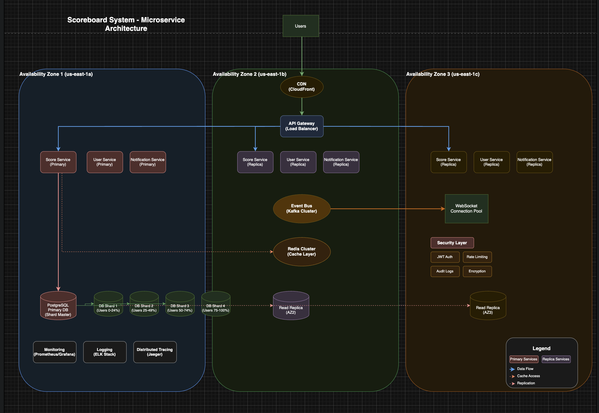
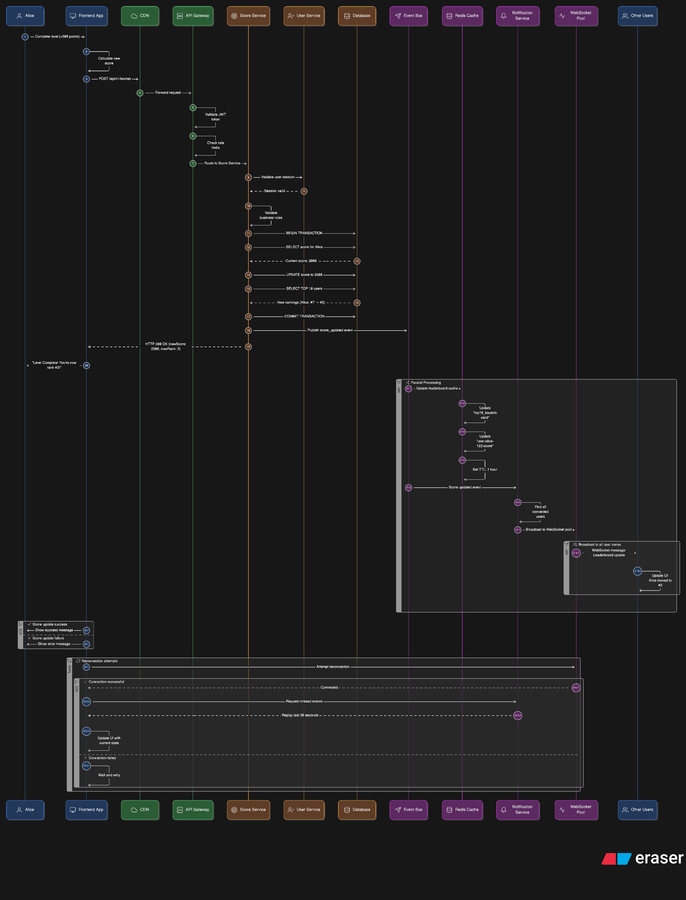

# Scoreboard System Architecture Specification

## Table of Contents
1. [System Overview](#system-overview)
2. [API Service Module](#api-service-module)
3. [Authentication & Authorization](#authentication--authorization)
4. [Real-Time Updates Implementation](#real-time-updates-implementation)
5. [Scalability Considerations](#scalability-considerations)
6. [Failure Recovery Strategies](#failure-recovery-strategies)
7. [Monitoring & Observability](#monitoring--observability)
8. [Assumptions & Limitations](#assumptions--limitations)
9. [Future Improvements](#future-improvements)

---

## System Overview

The scoreboard system is designed as a microservice-based architecture that provides real-time score tracking and leaderboard functionality. The system handles user actions that increment scores and maintains a live top-10 leaderboard visible to all users.

### Architecture Diagram



*Figure 1: Complete system architecture showing multi-AZ deployment, microservices, event-driven communication, and database sharding across three availability zones.*

<details>
<summary>📱 Click here if image doesn't load - View Text-Based Diagram</summary>

```
                                    [Users]
                                       |
                                   [CDN Layer]
                                       |
                               [API Gateway]
                                   |   |   |
                    +--------------+   |   +--------------+
                    |                  |                  |
            [Availability Zone 1]  [Availability Zone 2]  [Availability Zone 3]
                    |                  |                  |
            +-------+-------+  +-------+-------+  +-------+-------+
            |       |       |  |       |       |  |       |       |
       [Score] [User] [Notif] [Score] [User] [Notif] [Score] [User] [Notif]
       Service Service Service Service Service Service Service Service Service
            |       |       |  |       |       |  |       |       |
            +-------+-------+--+-------+-------+--+-------+-------+
                           |           |           |
                      [Event Bus - Kafka Cluster]
                           |           |           |
                      [Redis Cache Cluster]
                           |           |           |
            +-------+-------+--+-------+-------+--+-------+-------+
            |       |       |  |       |       |  |       |       |
        [Primary]  [DB]   [DB] [Read]  [DB]   [DB] [Read]  [DB]   [DB]
        Database  Shard1 Shard2 Replica Shard3 Shard4 Replica Shard5 Shard6
```

</details>

> 📋 **Quick Navigation**: 
> - For detailed component explanations → See [BEGINNER_GUIDE.md](./BEGINNER_GUIDE.md)
> - For real-time flow walkthrough → See [REALTIME_FLOW.md](./REALTIME_FLOW.md)  
> - For sequence diagrams and flows → See [SEQUENCE_DIAGRAMS.md](./SEQUENCE_DIAGRAMS.md)
> - For architecture justification → See [WHY_COMPLEX.md](./WHY_COMPLEX.md)
> - For implementation timeline → See [IMPLEMENTATION_ROADMAP.md](./IMPLEMENTATION_ROADMAP.md)

### High-Level Architecture Components

| Component | Purpose | Technology Stack |
|-----------|---------|------------------|
| **Frontend Application** | User interface for scoreboard viewing and actions | React/Vue.js + WebSocket client |
| **CDN** | Static asset delivery and edge caching | CloudFront/CloudFlare |
| **API Gateway** | Single entry point, routing, rate limiting | AWS API Gateway/Kong |
| **Score Service** | Core business logic for score management | Node.js/Java Spring Boot |
| **User Service** | User authentication and profile management | Node.js/Java Spring Boot |
| **Notification Service** | Real-time update delivery | Node.js with Socket.io |
| **Database Cluster** | Persistent data storage with sharding | PostgreSQL/MySQL with read replicas |
| **Cache Layer** | Fast data retrieval for leaderboards | Redis Cluster |
| **Event Bus** | Asynchronous communication between services | Apache Kafka/AWS EventBridge |
| **Load Balancers** | Traffic distribution across instances | Application Load Balancer |

### System Flow Overview

```
🎮 User Action → 🌐 CDN → 🚪 API Gateway → 🔧 Microservices → 📨 Event Bus → 📢 Real-time Updates
                                              ↓
                                            🗄️ Database Cluster ← → 📦 Cache Layer
```



**Real-Time Leaderboard Update Flow:**
1. **User completes action** → Score update request sent
2. **API Gateway** → Authenticates user and routes request  
3. **Score Service** → Validates and processes score update
4. **Database** → Persists new score and calculates rankings
5. **Event Bus** → Broadcasts score change event
6. **Notification Service** → Delivers real-time updates via WebSocket
7. **All connected users** → See leaderboard update instantly (< 1 second)

### Architecture Diagram Files
- **Visual Diagram**: `architecture.drawio` (editable with draw.io)
- **Text-based Overview**: [ARCHITECTURE_DIAGRAM.md](./ARCHITECTURE_DIAGRAM.md)
- **Sequence Diagrams**: [SEQUENCE_DIAGRAMS.md](./SEQUENCE_DIAGRAMS.md) - Shows detailed interaction flows

---

## API Service Module

### Score Service (Backend Application Server)

The Score Service is the core microservice responsible for managing user scores and leaderboard data.

#### Core Responsibilities
- **Score Updates**: Process and validate score increment requests
- **Leaderboard Management**: Maintain and serve top-10 user rankings
- **Data Consistency**: Ensure atomic score updates across sharded databases
- **Event Publishing**: Emit score change events for real-time updates

#### API Endpoints

| Endpoint | Method | Description | Authentication |
|----------|--------|-------------|----------------|
| `/api/v1/scores` | POST | Update user score | Required (JWT) |
| `/api/v1/leaderboard` | GET | Retrieve top-10 scores | Optional |
| `/api/v1/users/{userId}/score` | GET | Get specific user score | Required (JWT) |
| `/api/v1/health` | GET | Service health check | None |

#### Score Update Flow
```
1. Frontend → API Gateway → Score Service
2. Score Service validates JWT token and user permissions
3. Score Service applies business rules and validates score increment
4. Score Service updates database (with retry logic)
5. Score Service publishes score_updated event to Event Bus
6. Score Service returns success response
7. Notification Service consumes event and broadcasts to connected clients
```

#### Data Models

**Score Entity**
```json
{
  "userId": "string (UUID)",
  "username": "string",
  "currentScore": "integer",
  "lastUpdated": "timestamp",
  "version": "integer (for optimistic locking)"
}
```

**Score Update Request**
```json
{
  "actionType": "string",
  "scoreIncrement": "integer",
  "timestamp": "timestamp",
  "sessionId": "string"
}
```

---

## Authentication & Authorization

### Strategy Overview
Multi-layered security approach to prevent malicious score tampering while maintaining system performance.

### Authentication Mechanisms

#### 1. JWT Token-Based Authentication
- **Access Tokens**: Short-lived (15 minutes) for API calls
- **Refresh Tokens**: Long-lived (7 days) for token renewal
- **Token Structure**: Contains user ID, permissions, and session metadata

#### 2. Session Validation
- **Session Tracking**: Maintain active user sessions in Redis
- **Concurrent Session Limits**: Maximum 3 active sessions per user
- **Session Fingerprinting**: Device and IP validation

### Authorization Controls

#### 1. Action-Based Permissions
```javascript
// Example permission structure
{
  "userId": "user-123",
  "permissions": {
    "score.update": true,
    "score.view": true,
    "leaderboard.view": true
  },
  "rateLimit": {
    "scoreUpdates": "10/minute",
    "apiCalls": "100/minute"
  }
}
```

#### 2. Business Rule Validation
- **Score Increment Limits**: Maximum score increase per action (configurable)
- **Time-based Restrictions**: Minimum interval between score updates (5 seconds)
- **Action Validation**: Verify action legitimacy through external service calls
- **Anomaly Detection**: Flag suspicious scoring patterns

#### 3. Anti-Tampering Measures
- **Request Signing**: HMAC signature validation for critical operations
- **Idempotency Keys**: Prevent duplicate score submissions
- **Audit Logging**: Complete trail of all score modifications
- **Real-time Monitoring**: Alert on unusual scoring patterns

### Security Implementation

#### API Gateway Level
```yaml
# Rate limiting configuration
rateLimiting:
  - path: "/api/v1/scores"
    method: "POST"
    limit: "10 requests/minute"
    burst: 5
  - path: "/api/v1/*"
    method: "*"
    limit: "100 requests/minute"
    burst: 20
```

#### Service Level Validation
```javascript
// Pseudo-code for score update validation
async function validateScoreUpdate(request, user) {
  // 1. Verify user session is active
  await validateActiveSession(user.sessionId);
  
  // 2. Check rate limits
  await checkRateLimit(user.id, 'score_update');
  
  // 3. Validate score increment
  if (request.scoreIncrement > MAX_SCORE_INCREMENT) {
    throw new ValidationError('Score increment too large');
  }
  
  // 4. Verify action legitimacy
  await verifyActionCompleted(request.actionType, user.id);
  
  // 5. Check for duplicate requests
  await checkIdempotency(request.idempotencyKey);
  
  return true;
}
```

---

## Real-Time Updates Implementation

### Technology Choice: WebSockets + Event-Driven Architecture

The system uses a combination of WebSockets for client connections and an event-driven architecture for scalable real-time updates.

### Implementation Architecture

#### 1. WebSocket Connection Management
- **Connection Gateway**: Dedicated service for WebSocket connections
- **Connection Pooling**: Distribute connections across multiple instances
- **Connection Authentication**: Validate JWT on connection establishment
- **Heartbeat Mechanism**: Regular ping/pong to maintain connections

#### 2. Event-Driven Update Flow

```
Score Update → Event Bus → Notification Service → WebSocket Broadcast
```

**Detailed Flow:**
1. Score Service publishes `score_updated` event to Kafka topic
2. Notification Service consumes events from Kafka
3. Notification Service determines affected clients (leaderboard viewers)
4. Notification Service broadcasts updates via WebSocket connections
5. Frontend receives real-time leaderboard updates

#### 3. Event Schema

```json
{
  "eventType": "score_updated",
  "eventId": "uuid",
  "timestamp": "2025-09-08T10:00:00Z",
  "data": {
    "userId": "user-123",
    "username": "player1",
    "newScore": 1500,
    "previousScore": 1400,
    "newRank": 3,
    "previousRank": 5
  },
  "metadata": {
    "version": "1.0",
    "source": "score-service"
  }
}
```

#### 4. Fallback Mechanisms
- **Polling Fallback**: HTTP polling every 5 seconds if WebSocket fails
- **Event Replay**: Store recent events in Redis for connection recovery
- **Graceful Degradation**: Show cached leaderboard if real-time updates fail

### Alternative Approaches Considered

| Approach | Pros | Cons | Decision |
|----------|------|------|----------|
| **Server-Sent Events (SSE)** | Simpler implementation, auto-reconnect | One-way communication only | ❌ Not chosen |
| **HTTP Polling** | Simple, reliable | High server load, higher latency | ❌ Used as fallback only |
| **WebSockets + Pub/Sub** | Real-time, bidirectional, scalable | More complex implementation | ✅ **Chosen** |

---

## Scalability Considerations

### Horizontal Scaling Strategy

#### 1. CDN Configuration
- **Static Assets**: JavaScript, CSS, images cached at edge locations
- **API Response Caching**: Cache GET endpoints for 30 seconds
- **Geographic Distribution**: Multi-region CDN for global user base

```yaml
# CDN Cache Configuration
cacheRules:
  - pattern: "*.js,*.css,*.png,*.jpg"
    ttl: "1 year"
    compress: true
  - pattern: "/api/v1/leaderboard"
    ttl: "30 seconds"
    vary: ["Accept-Encoding"]
```

#### 2. API Gateway Scaling
- **Auto-scaling**: Scale instances based on request volume
- **Request Routing**: Intelligent routing based on service load
- **Circuit Breaker**: Prevent cascade failures during high load

#### 3. Microservice Auto-scaling

| Service | Scaling Trigger | Min Instances | Max Instances |
|---------|----------------|---------------|---------------|
| **Score Service** | CPU > 70% or RPS > 1000 | 2 | 20 |
| **User Service** | CPU > 60% or RPS > 500 | 2 | 10 |
| **Notification Service** | Active connections > 5000 | 2 | 15 |

#### 4. Database Scaling

##### Sharding Strategy
```sql
-- Shard by user ID hash
CREATE TABLE scores_shard_0 AS SELECT * FROM scores WHERE user_id_hash % 4 = 0;
CREATE TABLE scores_shard_1 AS SELECT * FROM scores WHERE user_id_hash % 4 = 1;
CREATE TABLE scores_shard_2 AS SELECT * FROM scores WHERE user_id_hash % 4 = 2;
CREATE TABLE scores_shard_3 AS SELECT * FROM scores WHERE user_id_hash % 4 = 3;
```

##### Read Replica Configuration
- **Write Operations**: Route to primary database
- **Read Operations**: Route to read replicas with load balancing
- **Leaderboard Queries**: Use dedicated read replica with materialized views

#### 5. Cache Layer Scaling
- **Redis Cluster**: 6-node cluster with replication
- **Cache Warming**: Pre-populate leaderboard cache during deployment
- **Cache Invalidation**: Event-driven cache updates

```javascript
// Cache invalidation strategy
async function invalidateLeaderboardCache(scoreUpdateEvent) {
  const affectedRanks = calculateAffectedRanks(scoreUpdateEvent);
  
  // Invalidate specific cache keys
  await redis.del([
    'leaderboard:top10',
    'leaderboard:global',
    ...affectedRanks.map(rank => `leaderboard:rank:${rank}`)
  ]);
  
  // Trigger cache warming
  await warmLeaderboardCache();
}
```

### Multi-AZ Deployment

#### Availability Zone Distribution
- **Primary AZ**: us-east-1a (Database primary, core services)
- **Secondary AZ**: us-east-1b (Read replicas, backup services)
- **Tertiary AZ**: us-east-1c (Additional redundancy)

#### Service Distribution
```yaml
# Kubernetes deployment example
apiVersion: apps/v1
kind: Deployment
metadata:
  name: score-service
spec:
  replicas: 6
  template:
    spec:
      affinity:
        podAntiAffinity:
          requiredDuringSchedulingIgnoredDuringExecution:
          - labelSelector:
              matchLabels:
                app: score-service
            topologyKey: "topology.kubernetes.io/zone"
```

---

## Failure Recovery Strategies

### Database Failure Recovery

#### 1. Primary Database Failure
```yaml
# Automatic failover configuration
failover:
  enabled: true
  timeout: "30 seconds"
  healthCheck:
    interval: "5 seconds"
    endpoint: "/health"
  promotion:
    strategy: "automatic"
    readReplica: "nearest"
```

**Recovery Process:**
1. Health check detects primary failure
2. Promote nearest read replica to primary (automated)
3. Update DNS records to point to new primary
4. Restart applications with new database endpoint
5. Verify data consistency and resume operations

#### 2. Shard Failure Recovery
- **Replica Promotion**: Promote read replica of failed shard
- **Data Rebalancing**: Redistribute data across remaining shards
- **Service Degradation**: Temporarily serve cached data for affected users

### Service Failure Recovery

#### 1. Individual Service Failures
```javascript
// Circuit breaker implementation
const circuitBreaker = new CircuitBreaker(scoreService.updateScore, {
  timeout: 3000,
  errorThresholdPercentage: 50,
  resetTimeout: 30000
});

// Fallback mechanism
circuitBreaker.fallback(() => {
  // Return cached score or queue for later processing
  return queueScoreUpdate(request);
});
```

#### 2. Cascading Failure Prevention
- **Bulkhead Pattern**: Isolate critical resources
- **Rate Limiting**: Prevent service overload
- **Graceful Degradation**: Serve essential features only

### Event Bus Failure Recovery

#### 1. Kafka Cluster Failure
- **Multi-AZ Kafka**: Deploy across 3 availability zones
- **Message Persistence**: Configure appropriate retention policies
- **Consumer Groups**: Ensure message processing continues

#### 2. Event Processing Failures
```javascript
// Dead letter queue for failed events
const deadLetterQueue = new Queue('failed-score-updates', {
  redis: redisConnection,
  defaultJobOptions: {
    attempts: 3,
    backoff: {
      type: 'exponential',
      delay: 2000
    }
  }
});
```

### Real-Time Connection Recovery

#### 1. WebSocket Connection Failures
- **Automatic Reconnection**: Exponential backoff strategy
- **Event Replay**: Replay missed events upon reconnection
- **Connection Pooling**: Distribute load across connection servers

```javascript
// WebSocket reconnection logic
class WebSocketManager {
  connect() {
    this.ws = new WebSocket(this.url);
    this.ws.onclose = () => this.handleDisconnect();
  }
  
  handleDisconnect() {
    this.reconnectAttempts++;
    const delay = Math.min(1000 * Math.pow(2, this.reconnectAttempts), 30000);
    setTimeout(() => this.connect(), delay);
  }
}
```

---

## Monitoring & Observability

### Application Performance Monitoring (APM)

#### 1. Key Metrics to Track

| Metric Category | Specific Metrics | Threshold/SLA |
|----------------|------------------|---------------|
| **Availability** | Service uptime, endpoint availability | 99.9% |
| **Performance** | Response time, throughput, error rate | p95 < 200ms |
| **Business** | Score updates/sec, active users, leaderboard views | Custom |
| **Infrastructure** | CPU, memory, disk, network utilization | < 80% |

#### 2. Alerting Strategy

```yaml
# Alert configuration example
alerts:
  - name: "High Error Rate"
    condition: "error_rate > 5%"
    duration: "2 minutes"
    severity: "critical"
    channels: ["slack", "pagerduty"]
  
  - name: "Score Update Latency"
    condition: "score_update_p95 > 500ms"
    duration: "5 minutes"
    severity: "warning"
    channels: ["slack"]
```

### Distributed Tracing

#### Implementation with OpenTelemetry
```javascript
// Trace score update flow
const tracer = opentelemetry.trace.getTracer('score-service');

async function updateScore(userId, increment) {
  return tracer.startActiveSpan('score.update', async (span) => {
    span.setAttributes({
      'user.id': userId,
      'score.increment': increment
    });
    
    try {
      // Update logic here
      const result = await scoreRepository.updateScore(userId, increment);
      span.setStatus({ code: SpanStatusCode.OK });
      return result;
    } catch (error) {
      span.recordException(error);
      span.setStatus({ code: SpanStatusCode.ERROR });
      throw error;
    } finally {
      span.end();
    }
  });
}
```

### Logging Strategy

#### 1. Structured Logging
```json
{
  "timestamp": "2025-09-08T10:00:00Z",
  "level": "INFO",
  "service": "score-service",
  "traceId": "abc123",
  "spanId": "def456",
  "userId": "user-123",
  "action": "score_update",
  "score": {
    "previous": 1400,
    "new": 1500,
    "increment": 100
  },
  "duration": 150
}
```

#### 2. Log Aggregation
- **ELK Stack**: Elasticsearch, Logstash, Kibana for log analysis
- **Retention Policy**: 30 days for application logs, 90 days for audit logs
- **Log Levels**: ERROR, WARN, INFO, DEBUG with appropriate filtering

### Business Intelligence Dashboards

#### Real-time Dashboards
1. **Operational Dashboard**: Service health, response times, error rates
2. **Business Dashboard**: Active users, score distribution, leaderboard activity
3. **Security Dashboard**: Failed authentication attempts, suspicious activity

#### Sample Grafana Dashboard Panels
```yaml
# Grafana dashboard configuration
dashboard:
  title: "Scoreboard System Overview"
  panels:
    - title: "Score Updates per Minute"
      type: "graph"
      query: "rate(score_updates_total[1m])"
    
    - title: "Top 10 Users by Score"
      type: "table"
      query: "topk(10, user_current_score)"
    
    - title: "Active WebSocket Connections"
      type: "stat"
      query: "websocket_connections_active"
```

---

## Assumptions & Limitations

### Technical Assumptions

1. **Infrastructure**: 
   - AWS cloud environment with managed services available
   - Kubernetes orchestration platform
   - High-speed internet connectivity for real-time features

2. **User Behavior**:
   - Maximum 100,000 concurrent users
   - Average 10 score updates per user per day
   - Peak traffic of 5x average during events

3. **Data Characteristics**:
   - Score values are non-negative integers
   - Maximum score per user: 1,000,000
   - Leaderboard shows top 10 users globally

### Current Limitations

#### 1. Geographic Distribution
- **Current**: Single region deployment (US East)
- **Impact**: Higher latency for international users
- **Mitigation**: CDN caching, regional read replicas

#### 2. Real-time Scalability
- **Current**: WebSocket connections limited to ~50,000 per instance
- **Impact**: May require additional instances during peak events
- **Mitigation**: Horizontal scaling, connection pooling

#### 3. Database Consistency
- **Current**: Eventual consistency for read replicas
- **Impact**: Temporary inconsistency in leaderboard rankings
- **Mitigation**: Cache warming, periodic consistency checks

#### 4. Security Considerations
- **Current**: Basic anti-tampering measures
- **Impact**: Sophisticated attacks may require additional measures
- **Mitigation**: Enhanced monitoring, machine learning for anomaly detection

### Operational Constraints

1. **Deployment Windows**: 
   - Planned maintenance during low-traffic hours (2-4 AM local time)
   - Zero-downtime deployments required for critical services

2. **Data Retention**:
   - Score history retained for 1 year
   - Audit logs retained for 3 years for compliance

3. **Compliance**:
   - GDPR compliance for user data handling
   - Data anonymization for analytics

---

## Future Improvements

### Short-term Enhancements (3-6 months)

#### 1. GraphQL API Gateway
**Rationale**: Reduce over-fetching and improve mobile performance

```graphql
# Example GraphQL schema
type Query {
  leaderboard(limit: Int = 10): [UserScore!]!
  userScore(userId: ID!): UserScore
}

type Mutation {
  updateScore(input: ScoreUpdateInput!): ScoreUpdateResult!
}

type Subscription {
  leaderboardUpdates: LeaderboardUpdate!
}
```

**Benefits**:
- Single endpoint for all data needs
- Real-time subscriptions for live updates
- Better type safety and documentation

#### 2. Advanced Caching Strategy
```yaml
# Multi-layer caching implementation
caching:
  layers:
    - name: "CDN"
      technology: "CloudFront"
      ttl: "5 minutes"
      scope: "global"
    
    - name: "Application Cache"
      technology: "Redis"
      ttl: "30 seconds"
      scope: "regional"
    
    - name: "Database Query Cache"
      technology: "PostgreSQL"
      ttl: "1 minute"
      scope: "local"
```

#### 3. Machine Learning for Fraud Detection
- **Anomaly Detection**: Identify unusual scoring patterns
- **Predictive Modeling**: Forecast potential abuse attempts
- **Real-time Scoring**: Risk assessment for each score update

### Medium-term Enhancements (6-12 months)

#### 1. Global Multi-Region Deployment
```yaml
# Multi-region architecture
regions:
  primary:
    region: "us-east-1"
    services: ["all"]
    database: "read-write"
  
  secondary:
    region: "eu-west-1"
    services: ["read-only", "cache"]
    database: "read-only"
  
  tertiary:
    region: "ap-southeast-1"
    services: ["read-only", "cache"]
    database: "read-only"
```

#### 2. Event Sourcing Architecture
**Benefits**:
- Complete audit trail of all score changes
- Ability to replay events and rebuild state
- Better debugging and analytics capabilities

```javascript
// Event sourcing example
const events = [
  { type: 'ScoreIncreased', userId: 'user-123', amount: 100, timestamp: '...' },
  { type: 'ScoreDecreased', userId: 'user-123', amount: 50, timestamp: '...' },
  { type: 'UserBanned', userId: 'user-123', timestamp: '...' }
];

// Rebuild user state from events
const currentScore = events
  .filter(e => e.userId === 'user-123')
  .reduce((score, event) => {
    switch(event.type) {
      case 'ScoreIncreased': return score + event.amount;
      case 'ScoreDecreased': return score - event.amount;
      case 'UserBanned': return 0;
      default: return score;
    }
  }, 0);
```

#### 3. Advanced Analytics Platform
- **Real-time Analytics**: Stream processing with Apache Flink
- **Data Lake**: Store all events for long-term analysis
- **ML Pipeline**: Automated model training and deployment

### Long-term Vision (12+ months)

#### 1. Serverless Architecture Migration
```yaml
# Serverless migration plan
services:
  score-service:
    technology: "AWS Lambda"
    trigger: "API Gateway"
    scaling: "automatic"
  
  notification-service:
    technology: "AWS Lambda + WebSocket API"
    trigger: "EventBridge"
    scaling: "concurrent executions"
```

#### 2. Blockchain Integration for Score Integrity
- **Immutable Score History**: Store critical score milestones on blockchain
- **Smart Contracts**: Automated score validation rules
- **Decentralized Verification**: Community-driven fraud detection

#### 3. AI-Powered Features
- **Personalized Leaderboards**: Custom rankings based on user preferences
- **Predictive Analytics**: Forecast user engagement and scoring trends
- **Automated Content Moderation**: AI-powered detection of inappropriate behavior

### Technology Stack Evolution

#### Current → Future Migration Path

| Component | Current | Future | Migration Strategy |
|-----------|---------|--------|-------------------|
| **API Layer** | REST | GraphQL | Gradual endpoint migration |
| **Database** | PostgreSQL | NewSQL (CockroachDB) | Data migration with zero downtime |
| **Caching** | Redis | Redis + Hazelcast | Hybrid approach |
| **Messaging** | Kafka | Apache Pulsar | Event stream migration |
| **Monitoring** | Prometheus/Grafana | Observability platform | Parallel deployment |

#### Performance Optimization Roadmap

1. **Database Optimization**:
   - Implement database connection pooling
   - Add database-level caching
   - Optimize query performance with better indexing

2. **Network Optimization**:
   - Implement HTTP/3 for improved connection management
   - Add request/response compression
   - Optimize payload sizes

3. **Application Optimization**:
   - Implement lazy loading for non-critical data
   - Add request batching for bulk operations
   - Optimize memory usage and garbage collection

---

## Conclusion

This architecture specification provides a robust, scalable foundation for the scoreboard system that meets all current requirements while providing clear paths for future growth. The design emphasizes security, real-time performance, and fault tolerance through proven architectural patterns and technologies.

The implementation should be approached in phases, starting with core functionality and gradually adding advanced features. Regular architecture reviews should be conducted to ensure the system continues to meet evolving business requirements and takes advantage of new technologies as they become available.

Key success metrics for this architecture include:
- **99.9% uptime** for the scoreboard service
- **Sub-200ms response times** for score updates
- **Real-time updates** delivered within 1 second
- **Zero successful fraud attempts** through comprehensive security measures
- **Seamless scaling** to support 10x user growth

This specification serves as the foundation for the engineering team to begin implementation while maintaining flexibility for future enhancements and optimizations.
